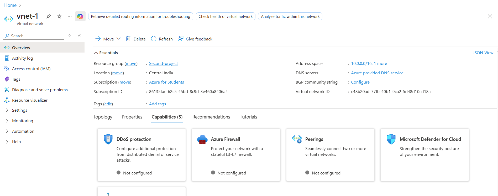
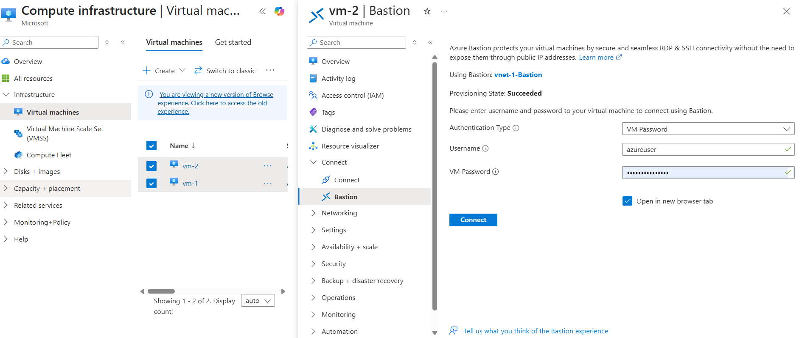
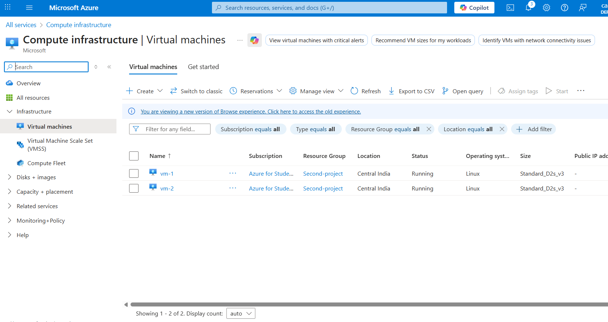
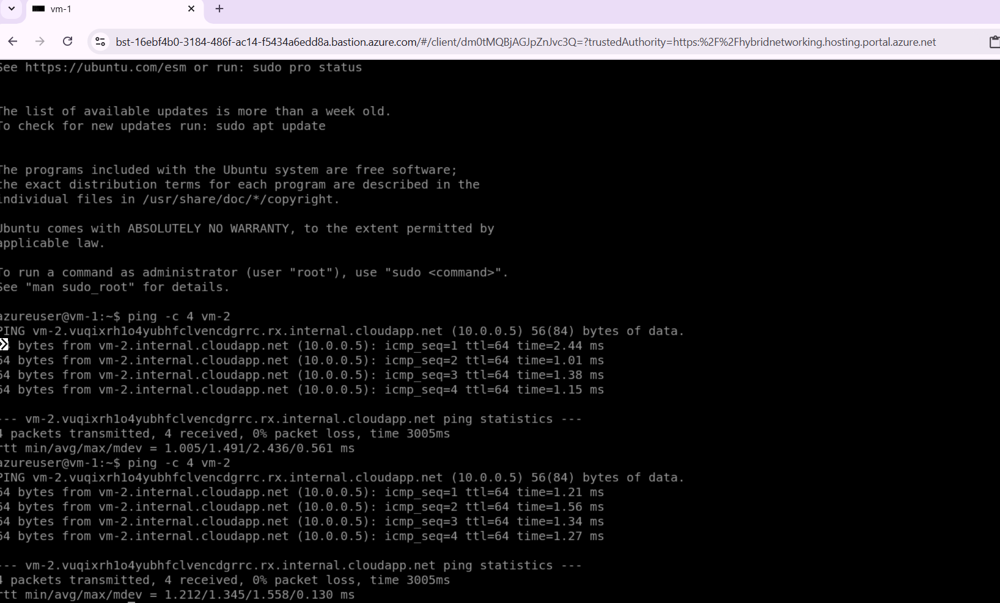
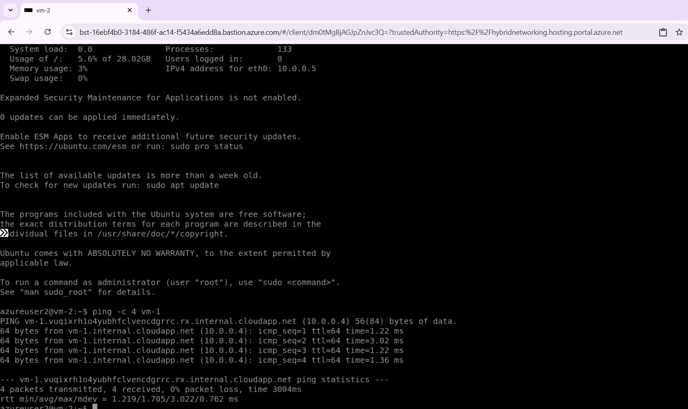

# Azure Virtual Network & Bastion Host Project

This project sets up a secure virtual network in Azure with two virtual machines and an Azure Bastion host. Bastion allows safe access to VMs without public IPs.

## What It Does
- Creates a virtual network (vnet-1)
- Adds a subnet for VMs and one for Bastion
- Deploys two Ubuntu VMs (vm-1 and vm-2)
- Enables Azure Bastion for secure browser-based access
- Tests internal VM communication using ping

## Tools Used
- Azure Portal
- Virtual Network
- Azure Bastion
- Ubuntu Server 22.04
- Network Security Group (NSG)

## Steps
- Create a resource group and virtual network
- Enable Azure Bastion with a public IP
- Deploy two VMs in the same subnet
- Connect to VMs using Bastion
- Run ping to test VM-to-VM communication

## Result
- VMs are securely accessible via Bastion
- Internal communication works using private IPs
- No public IPs needed for VMs

## Screenshots
- ### Virtual network setup

- ### Bastion configuration

- ### VM deployment

- ### Ping results between VMs
- ### vm1

- ### vm2

